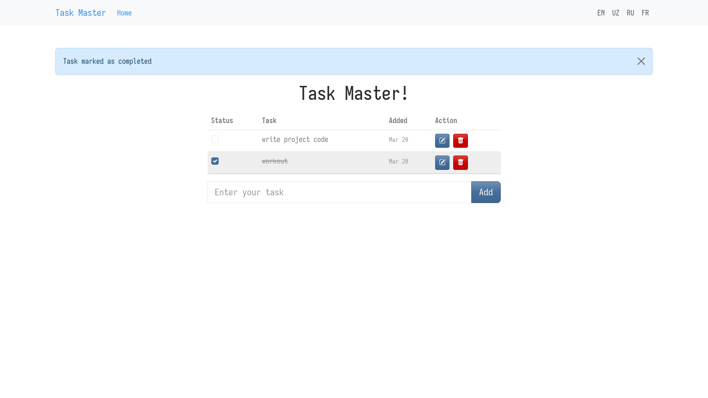
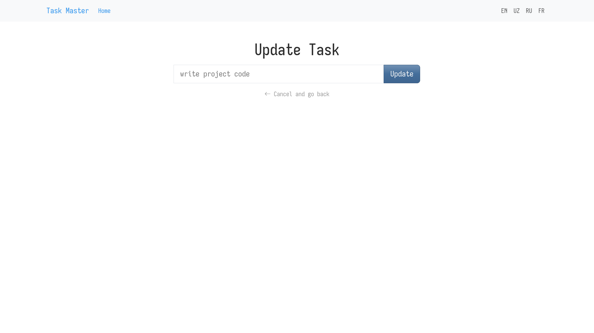

# Flask To-Do App

[](https://github.com/dvrone/flask-todo-app)  
[](https://taskmaster00.pythonanywhere.com/)

A simple and minimal **To-Do web application** built with Flask.  
Manage your daily tasks efficiently with add, update, and delete features in a clean interface.

---

## ✨ Features

- Add, update, and delete tasks
- User authentication (register & login)
- Flash messages for user feedback
- Multi-language support: English, Russian, French, Uzbek
- Responsive UI with Bootstrap
- SQLite database for storage

---

## 🛠 Tech Stack

- **Backend:** Flask, Flask-SQLAlchemy, Flask-Login, Flask-Babel  
- **Frontend:** Jinja2 templates, Bootstrap  
- **Database:** SQLite  

---

## 📁 Project Structure

```bash

.
├── app.py
├── babel.cfg
├── demo/
│   ├── home-page.png
│   └── update-page.png
├── instance/
│   └── todo.db
├── LICENSE
├── messages.pot
├── templates/
├── static/
├── requirements.txt
└── translations/

````

---

## 🌍 Internationalization

This project uses **Flask-Babel** for translations.  
Supported languages:

- English
- Russian
- French
- Uzbek

---

## 🚀 Getting Started

### 1. Clone the repository

```bash
git clone https://github.com/dvrone/flask-todo-app.git
cd flask-todo-app
````

### 2. Create and activate a virtual environment

```bash
python -m venv .venv
source .venv/bin/activate  # Linux/Mac
.venv\Scripts\activate     # Windows
```

### 3. Install dependencies

```bash
pip install -r requirements.txt
```

### 4. Run the app

```bash
flask run
```

Open your browser at: [http://127.0.0.1:5000/](http://127.0.0.1:5000/)

---

## 📸 Demo




Live demo: [https://taskmaster00.pythonanywhere.com/](https://taskmaster00.pythonanywhere.com/)

---

## 📚 Learn More

- Flask: [https://flask.palletsprojects.com/](https://flask.palletsprojects.com/)
- SQLAlchemy: [https://www.sqlalchemy.org/](https://www.sqlalchemy.org/)
- Bootstrap: [https://getbootstrap.com/](https://getbootstrap.com/)

---

## 📄 License

This project is licensed under the **MIT License**.
See [LICENSE](LICENSE) for details.
